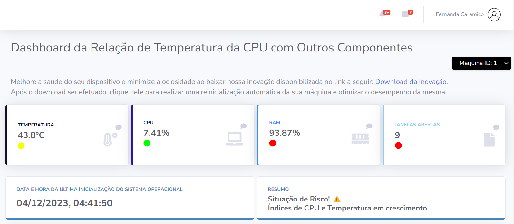

### Dashboard Relação de Temperatura da CPU com Outros Componentes 

Esta aplicação oferece uma interface intuitiva e informativa para monitorar a temperatura da CPU do seu sistema em tempo real. Desenvolvi esta solução para fornecer uma maneira fácil e visualmente atraente de acompanhar as métricas térmicas essenciais do seu hardware.

### Recursos Principais:
KPI´s Intuitivas: Mostrando em tempo real a temperatura, porcentagem de uso de CPU e RAM, quantidade de janelas abertas, data e hora da última inicialização do sistema operacional e um resumo geral sobre a situação da sua máquina.

Métricas: Feitas através de uma análise com RStudio pude definir métricas de alertas, verde para estável, amarelo para risco e vermelho para perigo, essas estão contidas tanto nas KPI´s quanto nos próprios gráficos.

Gráficos Interativos: Utilizando gráficos interativos, você pode analisar o histórico de temperatura e CPU ao longo do tempo, identificar tendências, facilitando a detecção de eventuais problemas de superaquecimento.

Tabelas dos Últimos 5 Registros em Alerta: Feitas com o objetivo de achar padrões e correlações, mostrando a máquina que foi capturada que aquele dado foi capturado, a data e hor, o valor e a situação da captura.

### Capturas de Dados:
O backend desta aplicação é implementado usando Python pela a biblioteca psutil para capturar dados de memória RAM e a data e hora da última inicialização do sistema operacional e Kotlin através da API Looca para capturar e processar os dados da temperatura da CPU, da própria CPU e das janelas abertas. 

### API´s:
Enviam dados tanto para o banco MySQL local como forma de contenção quanto para o SQL Server para os dados serem apresentados ao usuário através do IP Elátisco feito através da AWS.

### Apresentação para o usuário:

